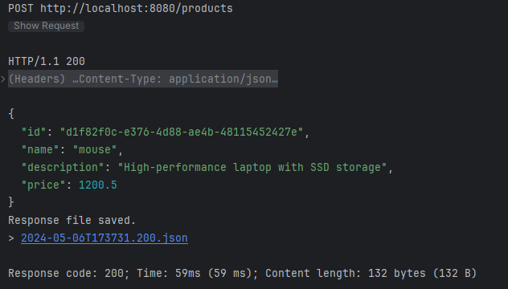
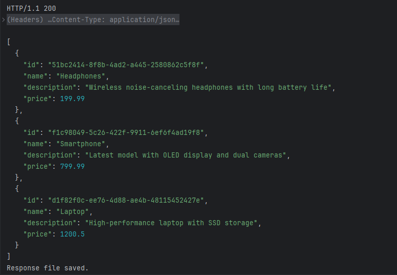
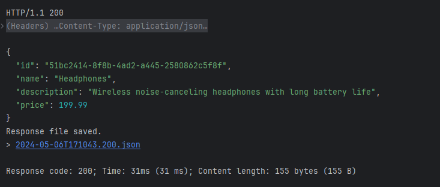
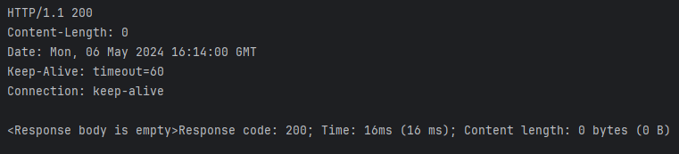
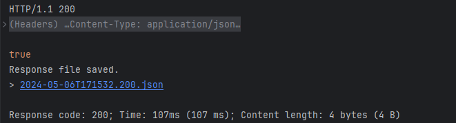

# Cassandra-et-Spring-Boot

## Introduction

L'objectif de ce TP est de manipuler une base de données Cassanda à partir d'une application Spring Boot, pour gérer un keystore nommé ecommerce qui va contenir une table products.

## Opérations CRUD

### Créer (POST)

Cette opération permet de créer un nouveau produit dans la base de données en envoyant une requête HTTP POST avec les détails du produit à créer.

### Lire Tous (GET)

Cette opération permet de récupérer tous les produits de la base de données en envoyant une requête HTTP GET.

### Lire (GET)

Cette opération permet de récupérer un produit spécifique de la base de données en envoyant une requête HTTP GET avec l'identifiant du produit.

### Mettre à Jour (PUT)

Cette opération permet de mettre à jour les détails d'un produit dans la base de données en envoyant une requête HTTP PUT avec les nouvelles informations du produit.

### Supprimer (DELETE)

Cette opération permet de supprimer un produit de la base de données en envoyant une requête HTTP DELETE avec l'identifiant du produit à supprimer.
